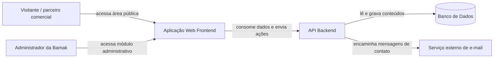

# Portal Web Institucional-Comercial para a Bamak

Repositório acadêmico do projeto **Portal Web Institucional-Comercial para a Bamak**, desenvolvido no **PAC VII do curso de Engenharia de Software**.

Este repositório documenta a primeira etapa do projeto: diagnóstico, definição de escopo, arquitetura da informação, arquitetura técnica, decisões de interface em baixa fidelidade e planejamento de continuidade. O foco deste semestre foi estruturar a proposta com base técnica suficiente para orientar a evolução no PAC 8.

O projeto parte de uma necessidade específica da **Bamak Equipamentos LTDA**: reorganizar sua presença digital para que o site deixe de funcionar como uma apresentação institucional pouco articulada e passe a orientar melhor o visitante antes do contato comercial.

---

## Sumário

- [Contexto](#contexto)
- [Problema trabalhado](#problema-trabalhado)
- [Objetivo da proposta](#objetivo-da-proposta)
- [Escopo definido no PAC VII](#escopo-definido-no-pac-vii)
- [Fora do escopo atual](#fora-do-escopo-atual)
- [Critérios usados na análise](#critérios-usados-na-análise)
- [Área pública proposta](#área-pública-proposta)
- [Módulo administrativo proposto](#módulo-administrativo-proposto)
- [Arquitetura definida](#arquitetura-definida)
- [Stack tecnológica proposta](#stack-tecnológica-proposta)
- [Artefatos produzidos](#artefatos-produzidos)
- [Status atual](#status-atual)
- [Autor](#autor)

---

## Contexto

A Bamak Equipamentos LTDA fornece materiais, peças e equipamentos para outras empresas, com destaque para aplicações ligadas à agroindústria.

Por atuar em um cenário B2B, o contato comercial depende de uma etapa prévia de entendimento. Antes de solicitar orçamento ou iniciar conversa com a empresa, o visitante precisa avaliar se a Bamak atende seu segmento, se os produtos apresentados fazem sentido para sua operação e quais canais de contato devem ser acionados.

O portal proposto atua nessa etapa anterior ao contato. Ele organiza a apresentação institucional, a leitura comercial da oferta e os caminhos para que o visitante chegue ao contato com mais contexto.

---

## Problema trabalhado

O site atual da Bamak apresenta limitações na forma como conecta informação institucional, organização comercial e contato.

A análise do projeto identificou problemas principalmente em:

- clareza da apresentação institucional;
- organização de segmentos atendidos;
- estruturação de soluções e produtos;
- orientação sobre orçamento e pedidos;
- visibilidade dos caminhos de contato;
- atualização pública de conteúdos;
- ausência de uma camada administrativa para manutenção recorrente.

O problema central do projeto é reorganizar essa presença digital em um portal institucional-comercial com páginas de função clara, navegação mais orientada ao visitante e base técnica preparada para gestão de conteúdo.

---

## Objetivo da proposta

Conceber a proposta de um portal web institucional-comercial para a Bamak, articulando:

- diagnóstico do site atual;
- comparação com referências acadêmicas e web;
- definição de escopo funcional;
- arquitetura da informação;
- arquitetura de software;
- prototipação lo-fi das páginas públicas principais;
- planejamento de continuidade para o PAC 8.

O resultado deste semestre não é um sistema em produção. A entrega do PAC VII é uma base técnica e documental para orientar a próxima etapa do projeto.

---

## Escopo definido no PAC VII

O escopo definido nesta etapa organiza o portal em duas frentes:

1. **Área pública institucional-comercial**, voltada ao visitante, parceiro ou potencial cliente.
2. **Módulo administrativo autenticado**, voltado à manutenção de conteúdos pela Bamak.

A proposta prioriza a estrutura das páginas públicas principais e a definição arquitetural do sistema. As páginas de detalhe e o aprofundamento visual do painel administrativo permanecem previstos para continuidade.

---

## Fora do escopo atual

O projeto foi delimitado para resolver um problema de comunicação institucional-comercial, não de transação ou gestão interna.

Ficam fora do escopo atual:

- e-commerce;
- carrinho de compras;
- checkout;
- pagamento online;
- orçamento automatizado;
- CRM;
- área de cliente;
- ERP;
- automação da negociação comercial;
- comprovação de impacto comercial.

Esses itens foram excluídos porque deslocariam o projeto para outro tipo de sistema. A proposta atual prepara melhor o contato comercial, mas não substitui a negociação da empresa.

---

## Critérios usados na análise

A proposta foi orientada por uma matriz comparativa entre artigos científicos, referências web do setor e o site atual da Bamak.

Os critérios analisados foram:

| Critério | Papel na proposta |
|---|---|
| Apresentação institucional clara | Avaliar se o visitante entende quem é a empresa e qual sua área de atuação. |
| Organização de segmentos e soluções | Verificar se a oferta comercial é apresentada por contextos de uso e frentes de atuação. |
| Navegação orientada ao usuário | Reduzir dispersão entre páginas e criar um percurso de consulta mais claro. |
| Contato comercial visível | Facilitar o avanço do visitante para os canais comerciais. |
| Orientação sobre orçamento e pedidos | Antecipar dúvidas recorrentes antes do contato. |
| Catálogo de produtos integrado | Evitar que produtos fiquem isolados da leitura institucional e comercial. |
| Atualização por painel administrativo | Permitir manutenção de conteúdo sem alteração direta no código. |
| Adequação ao contexto B2B | Manter o portal alinhado à lógica de venda consultiva e contato comercial. |
| Fluxo entre descoberta, entendimento e contato | Conectar a navegação do visitante do primeiro acesso até o acionamento comercial. |
| Aderência ao recorte agroindustrial | Manter a proposta próxima da atuação real da Bamak. |

A matriz apontou que a contribuição do projeto não está em copiar uma referência pronta, mas em combinar critérios de clareza, navegação, catálogo, FAQ, contato e gestão de conteúdo em uma proposta específica para a Bamak.

---

## Área pública proposta

A área pública foi estruturada em nove páginas principais.

| Página | Função |
|---|---|
| **Home** | Apresentar uma visão geral da Bamak e direcionar o visitante para as principais áreas do portal. |
| **A Bamak** | Organizar a apresentação institucional da empresa. |
| **Segmentos** | Mostrar os contextos de atuação atendidos pela Bamak. |
| **Soluções** | Agrupar frentes de solução oferecidas pela empresa. |
| **Catálogo** | Concentrar produtos em uma área própria de consulta. |
| **FAQ** | Responder dúvidas comerciais recorrentes antes do pedido de orçamento. |
| **Contato** | Centralizar canais comerciais e formulário de contato. |
| **Notícias** | Registrar publicações institucionais e comunicados. |
| **Agenda** | Apresentar eventos, feiras e acontecimentos relevantes. |

A navegação pública foi pensada como um fluxo de entendimento:

O catálogo não foi proposto como loja virtual. Ele funciona como área de consulta para apoiar a decisão do visitante antes do contato.

---

## Módulo administrativo proposto

O módulo administrativo foi delimitado em nível funcional, informacional e arquitetural.

Sua função é permitir que a Bamak atualize conteúdos centrais do portal sem depender de alteração direta no código a cada mudança.

Áreas previstas:

| Área administrativa | Finalidade |
|---|---|
| **Login administrativo** | Restringir acesso ao painel. |
| **Painel inicial** | Reunir atalhos e visão geral da manutenção de conteúdo. |
| **Notícias** | Gerenciar publicações institucionais. |
| **Agenda** | Manter eventos, feiras e datas relevantes. |
| **FAQ** | Atualizar perguntas e respostas recorrentes. |
| **Catálogo** | Gerenciar produtos e informações de consulta. |
| **Conteúdos institucionais** | Atualizar blocos de apresentação da empresa. |
| **Mensagens de contato** | Consultar registros enviados pelo formulário. |

O painel foi pensado como ferramenta editorial e comercial. Ele não tem função de CRM, ERP ou sistema operacional interno.

---

## Arquitetura definida

A arquitetura proposta segue o modelo **Web Apps**, com separação entre aplicação web, API backend, banco de dados relacional e serviço externo de e-mail.

### Responsabilidades

| Componente | Responsabilidade |
|---|---|
| **Aplicação Web Frontend** | Exibir páginas públicas, fluxos de navegação e acesso administrativo. |
| **API Backend** | Concentrar regras de negócio, autenticação, validações e operações de conteúdo. |
| **Banco de Dados** | Armazenar usuários administrativos, produtos, FAQ, notícias, agenda, conteúdos institucionais e mensagens de contato. |
| **Serviço de e-mail** | Encaminhar mensagens recebidas pelo formulário de contato. |

Essa separação evita que a interface concentre regras de negócio e persistência. A aplicação web apresenta o portal, enquanto a API e o banco sustentam a lógica e os dados administráveis.

---

## Stack tecnológica proposta

A stack foi definida como decisão técnica para a continuidade do projeto.

| Camada | Tecnologia | Motivo da escolha |
|---|---|---|
| **Frontend** | Next.js + TypeScript | Permite estruturar área pública e administrativa em uma base web tipada e componentizada. |
| **Interface** | Tailwind CSS + shadcn/ui | Dá flexibilidade para evoluir dos wireframes lo-fi para uma interface própria, sem prender o projeto a um tema fechado. |
| **Backend** | NestJS + TypeScript | Favorece organização modular para autenticação, catálogo, FAQ, notícias, agenda, conteúdos institucionais e contato. |
| **Banco de dados** | PostgreSQL | Adequado para conteúdos relacionais e administráveis. |
| **ORM** | Prisma | Apoia modelagem, migrations e acesso tipado ao banco. |
| **Autenticação** | JWT | Restringe operações administrativas ao usuário autenticado. |
| **Ambiente** | Docker | Padroniza o ambiente de desenvolvimento para a continuidade. |

A stack reforça a linha Web Apps do projeto: frontend próprio, backend próprio, banco relacional e autenticação administrativa explícita.

---

## Artefatos produzidos

Durante o PAC VII, foram produzidos artefatos para transformar o diagnóstico em proposta técnica.

| Artefato | Função no projeto |
|---|---|
| **Matriz comparativa** | Comparar artigos, referências web e o caso da Bamak para definir critérios de decisão. |
| **Definição de escopo** | Delimitar área pública, módulo administrativo e funcionalidades fora do recorte. |
| **Sitemap público** | Organizar a estrutura de páginas abertas ao visitante. |
| **Sitemap administrativo** | Organizar a estrutura funcional do painel de manutenção. |
| **Inventário de telas** | Registrar telas, funções e dependências entre áreas do portal. |
| **Wireflows** | Representar percursos de navegação pública e administrativa. |
| **Diagramas C1 e C2** | Modelar a visão de contexto e containers da arquitetura. |
| **Definição de stack** | Registrar tecnologias propostas para a continuidade. |
| **Wireframes lo-fi** | Materializar a estrutura inicial das páginas públicas principais. |
| **Cronograma projetado** | Planejar a continuidade no PAC 8. |

Esses artefatos não são peças isoladas. A matriz define critérios; os sitemaps organizam a estrutura; os wireflows mostram percursos; os diagramas conectam a solução ao modelo técnico; e os wireframes transformam a proposta em telas iniciais.

---

## Status atual

Estado do projeto ao final do PAC VII:

- diagnóstico do portal atual consolidado;
- critérios de análise definidos por matriz comparativa;
- escopo público e administrativo delimitado;
- páginas públicas principais definidas;
- módulo administrativo descrito em nível funcional;
- arquitetura Web Apps definida;
- stack tecnológica selecionada;
- wireframes lo-fi das páginas públicas principais produzidos;
- continuidade planejada para o PAC 8.

Ainda não fazem parte do estado atual:

- implementação funcional;
- telas finais de alta fidelidade;
- dashboard administrativo detalhado visualmente;
- páginas de detalhe completas;
- validação de uso com sistema funcional;
- métricas de impacto comercial.

---

## Autor

**Bredley Bauer**  
Curso de Engenharia de Software  
Centro Universitário Católica de Santa Catarina  
Jaraguá do Sul, SC, Brasil

---

## Referências do projeto

- Chakraborty, G.; Srivastava, P.; Warren, D. L. *Understanding corporate B2B web sites’ effectiveness from North American and European perspective*. Industrial Marketing Management, 2005.
- Chiou, W.-C.; Lin, C.-C.; Perng, C. *A strategic framework for website evaluation based on a review of the literature from 1995–2006*. Information & Management, 2010.
- Ramos, R. F.; Rita, P.; Moro, S. *From institutional websites to social media and mobile applications: A usability perspective*. European Research on Management and Business Economics, 2019.
- Bamak Equipamentos LTDA. Site oficial da Bamak Equipamentos LTDA.
- Texas Equipamentos. Página institucional.
- OBR Equipamentos Industriais. Página inicial.
