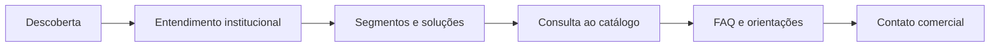
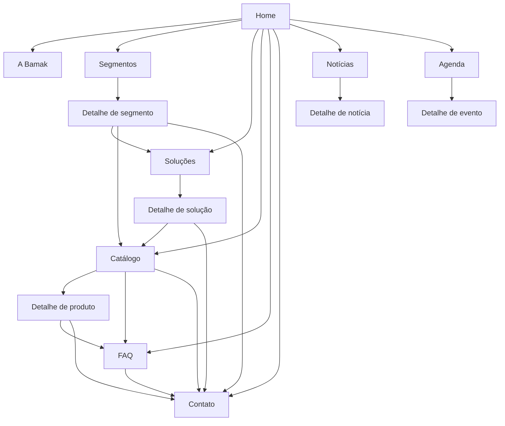

# Fluxo descoberta-contato

Este documento define o fluxo principal da área pública do **Portal Web Institucional-Comercial para a Bamak**.

O fluxo organiza a navegação do visitante B2B do primeiro acesso até o contato comercial. Ele foi criado para corrigir a principal lacuna diagnosticada no site atual: as informações institucionais, comerciais e de contato existem de forma pouco conectada, sem conduzir o visitante por uma sequência clara de entendimento.

## 1. Papel do fluxo no projeto

O portal da Bamak precisa orientar o visitante antes do contato comercial.

No contexto do projeto, o visitante não chega ao site para comprar diretamente. Ele chega para entender se a Bamak atende sua necessidade, se os produtos fazem sentido para sua operação e qual canal deve acionar.

Por isso, o fluxo público foi estruturado assim:

```txt
Descoberta → Entendimento institucional → Segmentos e soluções → Catálogo → FAQ → Contato comercial
```

Essa sequência evita três problemas do site atual:

| Problema observado | Como o fluxo responde |
|---|---|
| A empresa é apresentada sem formar percurso comercial claro. | A navegação começa pela Home e leva para A Bamak, Segmentos e Soluções. |
| Produtos aparecem sem integração suficiente com contexto e contato. | O Catálogo fica depois da leitura institucional e comercial. |
| O contato aparece como destino isolado. | O Contato passa a ser consequência da consulta e da orientação. |

## 2. Fluxo principal



## 3. Etapas do fluxo

### 3.1 Descoberta

**Página central:** `Home`

A Home é a entrada do portal. Ela precisa responder rapidamente três perguntas:

- que empresa é esta;
- em que tipo de mercado ela atua;
- para onde o visitante deve ir em seguida.

No caso da Bamak, a Home deve apresentar a empresa como fornecedora de materiais, peças e equipamentos para outras empresas, com destaque para aplicações na agroindústria.

#### Elementos esperados na Home

| Elemento | Função |
|---|---|
| Chamada institucional curta | Identificar a Bamak e seu campo de atuação. |
| Atalhos para Segmentos e Soluções | Levar o visitante para leitura comercial da oferta. |
| Chamada para Catálogo | Direcionar quem já quer consultar produtos. |
| Chamada para FAQ | Antecipar dúvidas antes do contato. |
| Chamada para Contato | Atender visitantes que já chegam decididos. |

#### Saída esperada

O visitante entende que o portal tem caminhos separados para conhecer a empresa, consultar oferta e iniciar contato.

---

### 3.2 Entendimento institucional

**Página central:** `A Bamak`

A página A Bamak concentra a explicação institucional. Ela não deve repetir a Home em formato longo. Sua função é dar contexto para o visitante avaliar a empresa.

#### Conteúdo esperado

| Bloco | Função |
|---|---|
| Apresentação da empresa | Explicar quem é a Bamak e o que fornece. |
| Atuação B2B | Deixar claro que o público principal são empresas, parceiros e clientes comerciais. |
| Recorte agroindustrial | Conectar a atuação da empresa ao contexto de aplicações na agroindústria. |
| Credibilidade institucional | Reforçar presença, experiência, área de atuação ou diferenciais reais quando validados. |
| Encaminhamento | Direcionar para Segmentos, Soluções ou Contato. |

#### Saída esperada

O visitante deixa de enxergar a Bamak apenas como nome ou logotipo e entende sua função como fornecedora no contexto B2B.

---

### 3.3 Segmentos e soluções

**Páginas centrais:** `Segmentos` e `Soluções`

Essa etapa traduz a atuação da empresa para o ponto de vista do visitante.

A página **Segmentos** responde onde a Bamak atua.  
A página **Soluções** responde como a empresa organiza sua oferta.

Essa separação é importante porque o visitante pode chegar por dois caminhos:

- pelo setor ou contexto em que atua;
- pelo tipo de solução ou produto que procura.

#### Segmentos

A página de Segmentos deve apresentar contextos atendidos pela Bamak. O foco não é criar uma lista decorativa de setores. Cada segmento deve ajudar o visitante a reconhecer se sua demanda se encaixa na atuação da empresa.

| Informação | Função |
|---|---|
| Nome do segmento | Identificar o contexto atendido. |
| Descrição objetiva | Explicar por que aquele segmento se relaciona com a Bamak. |
| Relação com soluções | Conectar segmento a frentes de solução. |
| Chamada para catálogo ou contato | Levar o visitante ao próximo passo. |

#### Soluções

A página de Soluções deve organizar frentes de atuação ou agrupamentos de oferta. Ela não substitui o catálogo, porque seu papel é explicar o tipo de solução antes da lista de produtos.

| Informação | Função |
|---|---|
| Nome da solução | Identificar a frente de atuação. |
| Descrição da aplicação | Explicar o contexto de uso. |
| Relação com produtos | Encaminhar para itens de catálogo quando fizer sentido. |
| Chamada para contato | Permitir avanço comercial com contexto. |

#### Saída esperada

O visitante identifica se a Bamak atua em um contexto compatível com sua necessidade antes de consultar produtos ou enviar mensagem.

---

### 3.4 Consulta ao catálogo

**Página central:** `Catálogo`

O Catálogo é uma área de consulta. Ele não representa loja virtual, carrinho, checkout ou orçamento automático.

Sua função é organizar produtos para que o visitante entenda a oferta antes do contato comercial.

#### Estrutura esperada

| Elemento | Função |
|---|---|
| Lista de produtos | Exibir itens disponíveis para consulta. |
| Categorias ou filtros | Reduzir esforço para localizar produtos. |
| Cards de produto | Mostrar nome, categoria e descrição curta. |
| Caminho para detalhe | Permitir aprofundamento no PAC 8. |
| Chamada para contato | Levar o visitante a pedir informação ou orçamento. |

#### Comportamento esperado

O visitante deve conseguir consultar produtos sem interpretar o portal como e-commerce.

O botão principal associado ao produto deve indicar contato ou solicitação comercial, não compra direta.

#### Saída esperada

O visitante encontra produtos de interesse, entende que a próxima etapa depende de conversa comercial e consegue avançar para FAQ ou Contato.

---

### 3.5 FAQ e orientações

**Página central:** `FAQ`

A FAQ fica antes do contato porque o portal precisa reduzir dúvidas básicas sobre pedidos, orçamento e atendimento.

Ela deve responder perguntas recorrentes que atrapalham o primeiro contato comercial quando ficam sem orientação.

#### Tipos de pergunta esperados

| Tipo | Exemplo de orientação |
|---|---|
| Orçamento | Quais informações ajudam a iniciar uma solicitação. |
| Pedido | Como o visitante deve encaminhar sua demanda. |
| Atendimento | Quais canais podem ser usados. |
| Produtos | Como consultar itens e pedir mais detalhes. |
| Segmentos | Como verificar aderência ao contexto de atuação. |

#### Critério para manter uma pergunta na FAQ

Uma pergunta só deve entrar se ajudar o visitante antes do contato.

Perguntas genéricas, institucionais demais ou sem relação com pedido, orçamento e navegação comercial devem ser evitadas.

#### Saída esperada

O visitante chega ao contato com dúvidas básicas resolvidas e com mais clareza sobre o que precisa informar.

---

### 3.6 Contato comercial

**Página central:** `Contato`

Contato é a etapa de conversão do fluxo público. A página deve reunir formulário e canais comerciais, mas sem funcionar isolada do restante do portal.

#### Estrutura esperada

| Elemento | Função |
|---|---|
| Formulário | Registrar demanda do visitante. |
| Campos de identificação | Nome, empresa, e-mail, telefone e mensagem. |
| Assunto ou tipo de demanda | Ajudar a qualificar o contato. |
| Canais diretos | Exibir telefone, e-mail ou WhatsApp quando definidos pela empresa. |
| Orientação curta | Explicar que o retorno depende da análise comercial da Bamak. |

#### Pontos de entrada para Contato

| Origem | Intenção provável |
|---|---|
| Home | Visitante já conhece a empresa ou quer falar direto. |
| A Bamak | Visitante entendeu a empresa e quer iniciar conversa. |
| Segmentos | Visitante identificou aderência ao seu contexto. |
| Soluções | Visitante viu uma frente de atuação relevante. |
| Catálogo | Visitante encontrou produto de interesse. |
| FAQ | Visitante tirou dúvidas e está pronto para enviar mensagem. |

#### Saída esperada

O visitante inicia contato com mais contexto sobre a Bamak, seus segmentos, soluções ou produtos.

## 4. Relação entre páginas públicas



## 5. Entradas alternativas

O visitante pode entrar no portal por diferentes intenções. O fluxo precisa aceitar atalhos sem perder coerência.

| Situação do visitante | Caminho provável | Observação |
|---|---|---|
| Não conhece a Bamak | Home → A Bamak → Segmentos/Soluções → Catálogo → FAQ → Contato | Caminho mais completo. |
| Procura produto | Home → Catálogo → Produto → FAQ → Contato | Catálogo precisa orientar sem parecer loja. |
| Quer saber se a empresa atende seu setor | Home → Segmentos → Soluções → Contato | Segmentos devem indicar aderência ao contexto. |
| Já conhece a empresa | Home → Contato | Atalho válido, desde que o contato esteja visível. |
| Tem dúvida sobre orçamento | Home → FAQ → Contato | FAQ prepara o envio da mensagem. |
| Chega por notícia ou evento | Notícias/Agenda → A Bamak ou Contato | Conteúdo institucional pode gerar contato indireto. |

## 6. Pontos de chamada para contato

O contato deve aparecer quando o visitante já tem contexto suficiente para agir.

| Página | Chamada recomendada |
|---|---|
| Home | Falar com a Bamak. |
| A Bamak | Entrar em contato após conhecer a empresa. |
| Segmentos | Consultar atendimento para um segmento. |
| Soluções | Conversar sobre uma solução. |
| Catálogo | Solicitar informação sobre produto. |
| Detalhe de produto | Pedir orientação ou orçamento. |
| FAQ | Enviar solicitação após tirar dúvidas. |
| Notícias | Falar com a empresa quando a publicação indicar oportunidade. |
| Agenda | Contato institucional sobre evento ou feira. |

## 7. Regras do fluxo

| Regra | Aplicação |
|---|---|
| O Catálogo é consultivo. | Não usar linguagem de compra, carrinho ou checkout. |
| A FAQ vem antes do Contato. | Usar FAQ para reduzir dúvidas repetitivas sobre pedido e orçamento. |
| Segmentos e Soluções não são sinônimos. | Segmentos tratam contexto atendido; Soluções tratam frentes de atuação. |
| Contato deve aparecer em pontos estratégicos. | Não depender apenas do menu ou rodapé. |
| Notícias e Agenda são apoio institucional. | Não devem competir com Catálogo, Segmentos e Contato como fluxo principal. |
| Páginas de detalhe dependem de conteúdo real. | Evitar telas detalhadas com texto genérico ou placeholder. |

## 8. O que fica para o PAC 8

No PAC VII, o fluxo define a arquitetura da informação. No PAC 8, ele deve ser usado para orientar telas detalhadas, interface refinada, implementação e validação.

Itens de continuidade:

| Item | Motivo |
|---|---|
| Detalhe de segmento | Aproxima contexto atendido de soluções e produtos. |
| Detalhe de solução | Explica a aplicação de uma frente de atuação. |
| Detalhe de produto | Dá base para contato comercial mais qualificado. |
| Detalhe de notícia | Permite leitura completa de publicação institucional. |
| Detalhe de evento | Dá contexto para agenda e presença institucional. |
| Teste do fluxo público | Verifica se o visitante entende e chega ao contato. |

## 9. Critérios de validação do fluxo

O fluxo deve ser validado por tarefas práticas no PAC 8.

| Critério | Pergunta de validação |
|---|---|
| Clareza institucional | O visitante entende quem é a Bamak depois de navegar pela Home e A Bamak? |
| Aderência comercial | O visitante identifica segmentos ou soluções compatíveis com sua necessidade? |
| Consulta de produtos | O visitante consegue encontrar produtos sem esperar compra online? |
| Orientação pré-contato | A FAQ responde dúvidas úteis antes do formulário? |
| Conversão para contato | O visitante encontra o contato no momento em que precisa agir? |
| Coerência do percurso | A navegação conecta empresa, oferta e contato sem saltos confusos? |

## 10. Síntese operacional

O fluxo descoberta-contato define como a área pública do portal deve funcionar.

A Home apresenta o portal.  
A página A Bamak dá contexto institucional.  
Segmentos e Soluções explicam a atuação.  
Catálogo organiza produtos para consulta.  
FAQ resolve dúvidas antes do envio.  
Contato recebe uma demanda mais contextualizada.

Esse fluxo transforma o portal em apoio ao contato B2B, mantendo o recorte definido no PAC VII: orientação institucional-comercial, catálogo consultivo, FAQ, contato visível e continuidade com módulo administrativo no PAC 8.
