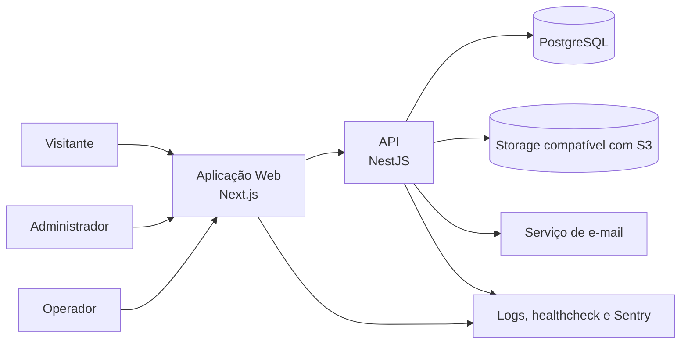
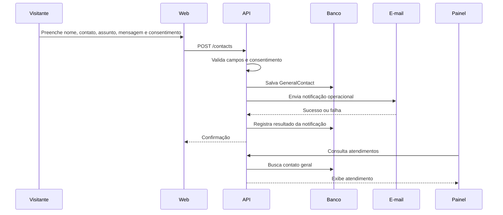
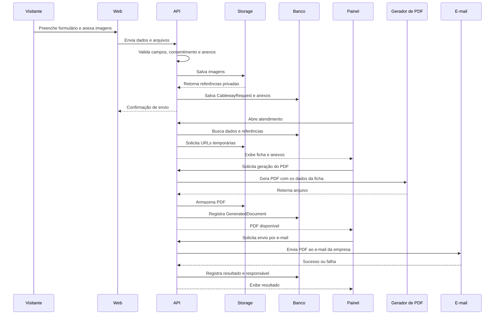

# Arquitetura Web Apps da linha de base

## 1. Escopo técnico

A arquitetura desta fase cobre o Portal Bamak em sua primeira versão funcional:

- área pública institucional-comercial;
- catálogo consultivo;
- formulário geral de contato;
- fluxo de Cabo Aéreo;
- painel administrativo;
- gestão limitada de Comunicação;
- geração, armazenamento e envio de PDF;
- autenticação de Administrador e Operador;
- deploy público com pipeline automatizado.

O sistema não inclui orçamento automático, cálculo técnico de Cabo Aéreo, CRM, ERP, área do cliente, checkout ou automação comercial.

## 2. Atores

### Visitante

Acessa a área pública sem autenticação para:

- conhecer a Bamak;
- consultar Aplicações;
- consultar o Catálogo;
- ler FAQ e Comunicação;
- enviar contato geral;
- enviar solicitação de Cabo Aéreo.

### Administrador

Acessa todas as áreas administrativas:

- Painel;
- Atendimentos;
- Comunicação;
- Configurações;
- usuários e acessos;
- geração, armazenamento e envio de PDF.

### Operador

Atua na rotina de atendimento:

- consulta Painel;
- acessa Atendimentos;
- consulta anexos;
- visualiza a ficha de Cabo Aéreo;
- gera PDF;
- envia PDF ao e-mail da empresa;
- atualiza estados permitidos.

O Operador não administra usuários nem configurações críticas.

## 3. Containers

| Container | Tecnologia | Responsabilidade |
|---|---|---|
| Aplicação Web | Next.js + TypeScript | Área pública, painel administrativo, formulários, mapa, upload e consumo da API. |
| API | NestJS + TypeScript | Autenticação, autorização, regras de negócio, persistência, geração de PDF, e-mail e acesso a arquivos. |
| Banco de Dados | PostgreSQL + Prisma | Usuários, perfis, produtos, aplicações, FAQ, Comunicação, contatos e solicitações. |
| Armazenamento de Arquivos | Serviço compatível com S3 | Imagens enviadas no Cabo Aéreo e PDFs gerados. |
| Serviço de E-mail | Provedor a definir no PAC VIII | Notificações operacionais e envio do PDF ao e-mail da empresa. |
| Observabilidade | Logs estruturados + healthcheck + Sentry | Diagnóstico de falhas de aplicação, upload, PDF, e-mail e autenticação. |

## 4. Diagrama de containers



## 5. Separação entre área pública e administrativa

### Área pública

Rotas previstas:

```text
/
 /institucional
 /aplicacoes
 /aplicacoes/[slug]
 /catalogo
 /catalogo/[slug]
 /cabo-aereo
 /faq
 /comunicacao
 /comunicacao/[slug]
 /contato
 /privacidade
```

A área pública não expõe anexos, fichas, PDFs ou dados de atendimento.

### Área administrativa

Rotas previstas:

```text
/admin/login
/admin
/admin/atendimentos
/admin/atendimentos/[id]
/admin/comunicacao
/admin/comunicacao/novo
/admin/comunicacao/[id]/editar
/admin/configuracoes
/admin/configuracoes/usuarios
```

Todas as rotas administrativas exigem autenticação. As ações disponíveis dependem do perfil.

## 6. Módulos da API

### Auth

Responsável por:

- login;
- emissão e renovação de token;
- logout;
- hash de senha;
- proteção das rotas administrativas.

### Users

Responsável por:

- criação de usuários;
- perfil Administrador ou Operador;
- ativação e desativação;
- alteração de senha;
- controle de acesso.

### Applications

Responsável por:

- listagem pública de Aplicações;
- detalhe de Aplicação;
- associação com produtos.

Na primeira versão, a estrutura desta área é mantida tecnicamente.

### Catalog

Responsável por:

- categorias;
- produtos;
- busca;
- filtros;
- detalhe de produto;
- associação com Aplicações.

O catálogo é consultivo. Não há preço obrigatório, carrinho ou pedido.

### Faq

Responsável por:

- listagem pública;
- ordenação;
- conteúdo das perguntas e respostas.

Na primeira versão, a manutenção é técnica.

### Communication

Responsável por:

- notícia;
- agenda;
- evento;
- feira;
- comunicado;
- rascunho;
- publicação;
- ocultação.

Esse é o único conteúdo público estruturalmente administrável pelo painel na primeira versão.

### GeneralContact

Responsável por:

- receber formulário geral;
- validar consentimento;
- registrar a entrada;
- disponibilizar o contato em Atendimentos;
- disparar notificação por e-mail quando configurada.

### CablewayRequest

Responsável por:

- receber dados do Cabo Aéreo;
- validar localização textual;
- registrar coordenada opcional;
- associar imagens;
- registrar consentimento;
- gerar a ficha interna;
- gerar PDF;
- armazenar o PDF;
- enviar o PDF ao e-mail da empresa.

### Attendance

Responsável por:

- reunir contato geral e Cabo Aéreo;
- diferenciar tipo de entrada;
- filtrar por período e estado;
- registrar alterações de estado;
- expor dados conforme permissão;
- associar arquivos e documentos.

### Storage

Responsável por:

- upload de imagens;
- validação de formato, tamanho e quantidade;
- armazenamento privado;
- geração de URL temporária;
- remoção autorizada;
- associação do arquivo ao atendimento correto.

### Pdf

Responsável por:

- montar o documento a partir da ficha interna;
- gerar versão identificada por atendimento;
- salvar no storage;
- registrar data, usuário e resultado;
- permitir reenvio sem gerar atendimento duplicado.

### Mail

Responsável por:

- notificação de novo contato;
- envio do PDF;
- registro de sucesso ou falha;
- permitir nova tentativa.

## 7. Fluxo técnico do contato geral



O contato geral não gera ficha estruturada nem PDF.

## 8. Fluxo técnico do Cabo Aéreo



## 9. Entidades principais

| Entidade | Dados centrais |
|---|---|
| User | nome, e-mail, senha, perfil, ativo |
| Role | Administrador, Operador |
| Application | nome, slug, resumo, conteúdo, imagem |
| ProductCategory | nome, slug |
| Product | nome, slug, descrição, categoria, imagens, aplicações |
| FaqItem | pergunta, resposta, ordem, ativo |
| CommunicationPost | tipo, título, slug, conteúdo, datas, status |
| GeneralContact | nome, contato, assunto, mensagem, consentimento, estado |
| CablewayRequest | contato, descrição, localização textual, coordenada opcional, consentimento, estado |
| Attachment | atendimento, tipo, nome, tamanho, chave no storage |
| GeneratedDocument | atendimento, chave no storage, criado por, enviado em, status de envio |
| AttendanceStatus | identificador, nome, ordem, ativo |

## 10. Estados de atendimento

A arquitetura deve suportar estados configuráveis, sem fixar ainda a lista definitiva.

Conjunto inicial para prototipação:

```text
Recebido
Em análise
Aguardando complemento
Em contato
Concluído
Arquivado
```

A validação com a Bamak definirá quais estados permanecem na implementação.

## 11. Segurança e privacidade

- formulários públicos com rate limiting;
- validação no frontend e no backend;
- consentimento obrigatório;
- anexos privados;
- URLs temporárias;
- senha com hash;
- rotas protegidas por perfil;
- segredos fora do repositório;
- logs sem dados pessoais completos;
- dados reais fora da documentação pública;
- retenção definitiva validada antes da produção.

## 12. Arquivos do Cabo Aéreo

Regras da primeira versão:

| Regra | Valor |
|---|---|
| Formatos | JPG, PNG e WebP |
| Quantidade | até 5 |
| Tamanho | até 10 MB por arquivo |
| Áudio | fora da primeira versão |
| Vídeo | fora da primeira versão |
| PDF enviado pelo cliente | fora da primeira versão |
| Acesso | painel autenticado |
| Armazenamento | compatível com S3 |

## 13. Pipeline e qualidade

GitHub Actions deve executar:

1. instalação;
2. lint;
3. verificação de tipos;
4. testes;
5. cobertura;
6. build;
7. análise do SonarCloud;
8. deploy, quando aplicável.

Critérios mínimos:

- backend com cobertura igual ou superior a 75%;
- frontend com cobertura igual ou superior a 25%;
- quality gate sem bloqueio;
- build aprovado;
- healthcheck disponível;
- erros críticos enviados ao Sentry.

## 14. Decisões pendentes

Permanecem para o PAC VIII:

- provedor de deploy;
- provedor de storage;
- serviço de e-mail;
- biblioteca de PDF;
- estados definitivos dos atendimentos;
- permissões detalhadas do Operador;
- prazo definitivo de retenção;
- campos finais do Cabo Aéreo.
